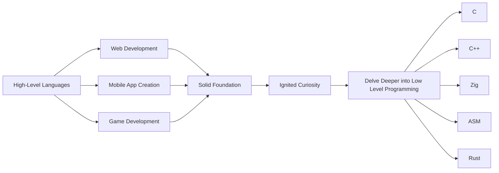

# 👋 Hello, World!

## 🌟 About Me

Hi there! I'm **Liga** from the **United States**. 🇺🇸

## 💻 My Programming Journey

I've been on an incredible programming journey for almost **9 years** now. Over the years, I've dabbled in various aspects of software development, but recently, I've found my true passion in **low-level development**. 🛠️

### 🏆 Awards
- 🥉 Bronze medalist in SkillsUSA Oregon 2024
- 🇺🇸 Nationalist nominee for SkillsUSA 2024
- ✨ 4 on AP Computer Science A exam
- 📋 Top 10 team for George Fox programming competition of 2024

### 🏁 Early Days

My programming adventure began with high-level languages, where I explored the vast landscapes of web development, app creation, and even some game development. These experiences laid a solid foundation for my skills and ignited my curiosity to delve deeper into the world of coding. 🌐📱🎮

### 🔍 Recent Focus

In the past few years, I've shifted my focus towards **low-level development**. This area fascinates me because it allows me to work closer to the hardware, optimize performance, and understand the inner workings of computer systems. It's like peeling back the layers of an onion to reveal the core. 🧅🔧

### 📊 Graphically

## 🚀 Skills & Expertise

- **Programming Languages:** C, C++, Rust, Zig, Rust, Python, Lua, Yue, Moon, JavaScript, TypeScript, PHP, C# (tl;dr anything you throw at me)
- **Formatting Languages:** HTML, CSS, SASS, Markdown, Mermaid
- **Tools & Technologies:** GCC, GDB, LLVM, Make, CMake, Ninja, Zig-build, Git, Mongo, SQL, R2, S3, IDA, Binary-Ninja, Ghidra, Cutter, Regex
- **Operating Systems:** Linux, Windows, Embedded Systems
- **Areas of Interest:** Systems Programming, Embedded Development, Performance Optimization

## ✏️ Projects

Current Aspiration:
#### 🐈‍⬛ **Kitty-Rust**: *"Kitty: Compiler, Interpreter, Runtime"* 🦀

*Most of the more important projects that I've worked on haven't been open-sourced yet.*

Notable Projects:
- **Apex Legends P.O.C. DMA Software**: [source](https://github.com/wednesdaywtf/apex-dma/tree/trunk) [video](https://streamable.com/fz89vg)
- **Apex Legends P.O.C. KVM Software**: [screenshot](https://imgur.com/xst12zp)
- **TF2 P.O.C. Windows x86 Software**: [video](https://streamable.com/dsyils) [research](https://www.unknowncheats.me/forum/team-fortress-2-a/593509-alternative-third-person-angles.html) *(source is lost; scattered along my SSD, unpartitioned, somewhere...)*
- **TF2 Hotwheels© Internal**: [source](https://github.com/hotwheels-vip/tf2-internal/)
- **CS:GO Hotwheels© External**: [source](https://github.com/hotwheels-vip/csgo-external)
- **CS:GO Hotwheels© External Driver**: [source](https://github.com/hotwheels-vip/csgo-external-driver)
- **CS:GO Wednesday Internal**: [source](https://github.com/windows-fryer/wednesday-csgo) [research](https://www.unknowncheats.me/forum/3324734-post4.html) *(fork of hotwheels cs:go with added features)* 
- **CS:GO Hotwheels© Internal**: [source](https://github.com/hotwheels-vip/csgo-internal)
- **TF2 Friend Code-Along P.O.C.**: [source](https://github.com/windows-fryer/skeletons_cx)

Fun Projects:
- **MuseDash DLC Unlocker**: [source](https://github.com/windows-fryer/musedash-unlocker)
- **Death Must Die Trainer**: [source](https://github.com/windows-fryer/death-must-gamble)
- **Lethal Company Trainer**: [source](https://github.com/wednesdaywtf/lethal-company)
- **Twitch Sniper Bot**: [source](https://github.com/windows-fryer/sniper-bot/)

Minor Projects / Gists:
- **C Windows Signature Scanner**: [source](https://github.com/windows-fryer/CigFinder)
- **Moonscript Bundler**: [source](https://github.com/windows-fryer/moon_bundler)

## 🌱 Always Learning

The world of programming is ever-evolving, and I am committed to continuous learning. Whether it's exploring new languages, diving into advanced algorithms, or staying updated with the latest industry trends, I'm always eager to expand my knowledge and skills. 📚🚀

## 🌐 Let's Connect

Feel free to reach out if you share similar interests or if you just want to chat about programming, technology, or anything else! You can find me on:

- [GitHub](https://github.com/windows-fryer/windows-fryer/) 🐙
- [Telegram](https://t.me/intCast) ✉️
- [E-Mail](mailto:liga@wednesday.wtf) 📬

---

Thank you for taking the time to learn a bit about me. I'm excited to connect with fellow enthusiasts and professionals in the tech community! 🚀
